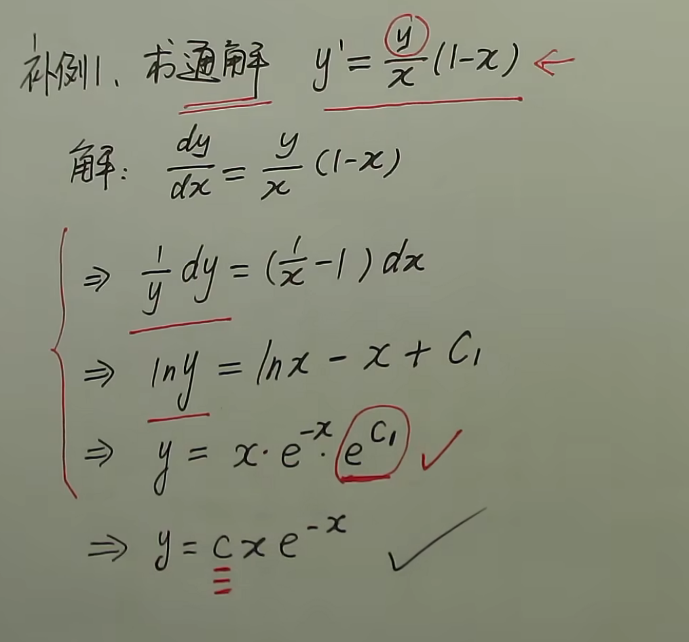

#

## 微分方程

### *可分离变量微分方程*

形式：$$g(y)dy = f(x)dx$$
解法：将$y'$换为$\frac{dy}{dx}$
例：

### *齐次微分方程*

形式：$$y'=\frac{dy}{dx}=f(\frac{y}{x})$$
解法：化为可分离变量微分方程
令$$\frac{y}{x}=\mu$$
$$y=\mu x$$
$$\frac{dy}{dx}=\mu+x\frac{d\mu}{dx}$$
$$\mu+x\frac{d\mu}{dx}=f(\mu)$$
例：

### *一阶微分方程*

形式：$$\frac{dy}{dx}+P(x)y=Q(x)$$

1. 齐次方程：Q(X)=0
可视为$$\frac{dy}{dx}=-P(x)$$
解得$$y=ce^{\int -p(x)\,dx}$$
2. 非齐次方程：Q(x)!=0
解的$$y=ce^{-\int p(x)\,dx}(c+{\int Q(x)e^{\int p(x)\,dx}\,dx})$$
例：

### *伯努利方程*

形式：$$\frac{dy}{dx}+p(x)y=Q(x)y^n$$
解法：$$①\frac{dy}{dx*y^n}+p(x)y^{1-n}=Q(x)$$
$$②\xi=y^(1-n)=>\frac{d\xi}{dx}=\frac{dy^{1-n}}{dx}=(1-n)y^{-n}\,\frac{dy}{dx}$$
未完成

### 可降阶微分方程

### 常系数线性微分方程

1. 齐次线性微分方程
形式:$$y''+py'+qy=0$$
设$$y=e^{rx}$$
系数方程：$$r^2+pr+q=0$$
①$\Delta>0$,$r_1 \neq r_2$
则$$y=c_1e^{r_1x}+c_2e^{r_2x}$$
例
②$\Delta=0$,$r_1 = r_2$
则$$y=(c_1+c_2)e^{rx}$$
例
②$\Delta<0$,$r_1=\alpha+\beta i$,$r_2=\alpha-\beta i$
则$$y=e^{\alpha x}(c_1 \cos \beta x+c_2\sin \beta x)$$
例

> 三阶常系数齐次微分方程
> 

2. 非齐次线性微分方程 ***非齐通=齐通+非齐特***
形式：$$y''+py'+qy=f(x)$$
①$$f(x)=e^{\lambda x}p_m(x)$$
其中：$\lambda$为常数，$p_m(x)$为x的多项式
特解y*的形式：$$e^{\lambda x}f_m(x)x^k$$
其中$f_(m)x$为x的多项式，$\lambda$与齐通中k个解相同，再将特解带入原方程，解出$f_m(x)$的系数
∴$y=y_通+y*$
例：

②$\Delta<0$$$f(x)=e^{\lambda x}[P_l(x)\cos{\omega x}+Q_n(x)\sin{\omega x}]$$
其中：$\lambda$，$\omega$为常数，$P_l(x)$,$Q_n(x)$为x的多项式
特解y*的形式：$$x^{k}e^{\lambda x}[R_m(x)\cos{\omega x}+O_m(x)\sin{\omega x}]$$
其中$R_m(x)$,$O_m(x)$为x的多项式,$m=l+n$,$\lambda+\omega i$与k个r相等,再将特解带入原方程，解出x多项式的系数
∴$y=y_通+y*$
例：
